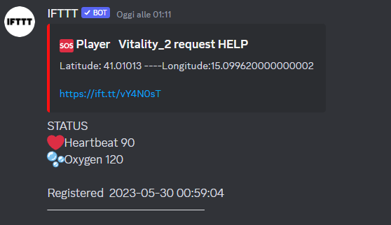
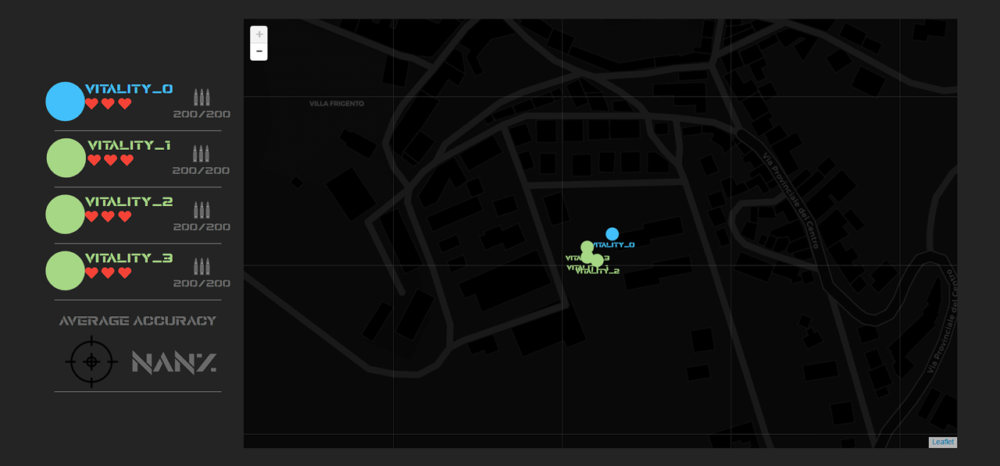
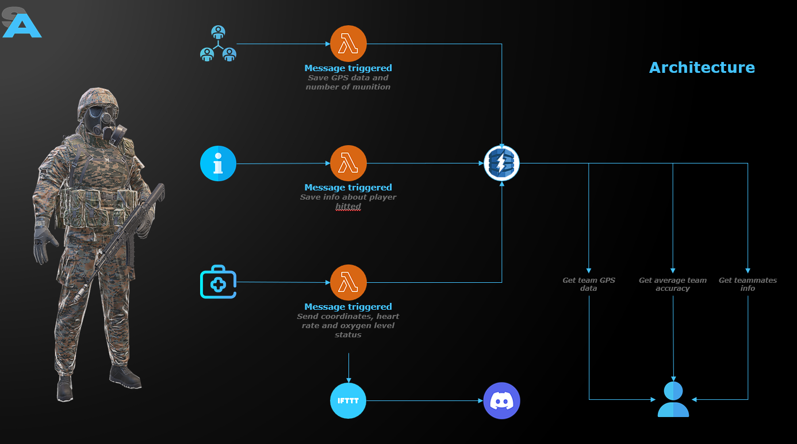

# SoftairAssistant
## Overview
SoftairAssistant is a project that aims to develop a device that can assist softair players during game sessions. It aims to provide real time assistance during game sessions by providing information regarding the GPS location of team members, the amount of ammunition left for each player, and the average accuracy of the team. It also provides the necessary information to intervene as quickly as possible in case of an emergency.

The project is based on an IoT Cloud Architecture where several IoT sensors collect data and send it to the cloud where it will be processed through serverless computation and stored in a NoSQL database to be easily accessible.
Sensors are placed on each player and measure their GPS location,heart rate,blood oxygen level. In addition,each player is equipped with a bulletproof vest with an RFID reader that can detect who the player was hit by by reading the RFID embedded in the bullets.
There is a queue for each team on which each sensor will send data containing the following information
- The ID of the player;
- time in format yyyy-mm-dd hh:mm:ss;
- latitude;
- longitude;
- The ID of the game;

Each time a message appear on these queue, an event triggered Servereless function save the data on the database

Inoltre è presente una coda relativa alle informazioni di ogni game su di cui verranno inviate i seguenti dati:
- the ID of the player hitted;
- time in format yyyy-mm-dd hh:mm:ss;
- the ID of the player who made the shot;
- the number of remaining lives of the hitted player
- the ID of the Game

All this data will be saved by an event triggered Serverless function on the database.

Infine è presente un'ultima coda relativa alle emergenze su di cui verranno inviate le seguenti informazioni:
- The ID of the player that call the SOS;
- time in format yyy-mm-dd hh:mm:ss;
- latitude;
- longitude;
- The ID of the game;
- oxygen level;
- heart rate;
- the status of emergency;

All data will then be stored in a database using an event triggered Serverless function.
The moment an emergency occurs the game will be paused and a message will be sent to the admin's discord channel containing all the information listed above. When the emergency is resolved the admin will be able to restart the game session.

As can be seen all submitted data contains the game id, this is because it might come in handy in case we want, in a future implementation, to ensure post-game support and allow each user to rewatch the game.
All the above data will be shown, via a GUI, to each user.

The GUI was built with HTML, CSS, JavaScript and using the [Leaflet](https://leafletjs.com/) library.

## Architecture

- LocalStack is used to emulate the cloud environment and duplicate the AWS services.
- A Python script that uses boto3 to transmit messages on the queues simulates the IoT devices on each player.
- Amazon Simple Queue Service (SQS) is being used to implement the queue.
- Amazon DynamoDB was used to create the database.
- The functions are Serveless functions deployed on AWS Lambda.
- Two IFTT Applets are used to send the message on Discord.
- Dynamodb-admin provides access to the DynamoDB GUI.

# Installation and usage
## Prerequisites 

1. [Docker](https://docs.docker.com/get-docker/)
2. [AWS CLI](https://docs.aws.amazon.com/cli/latest/userguide/getting-started-install.html)
3. [boto3](https://boto3.amazonaws.com/v1/documentation/api/latest/guide/quickstart.html)
4. *(Optional)* nodejs for database visualization.
5. [fastAPI](https://fastapi.tiangolo.com/)
6. [uvicorn](https://www.uvicorn.org/)

## Setting up the environment  

**1. Launch [LocalStack](https://localstack.cloud/)**

`docker run --rm -it -p 4566:4566 -p 4571:4571  localstack/localstack`

if u have some error when you call the Lambda function that ask something like "_mount /var/run/docker.sock:/var/run/docker.sock_" use the following command to run the docker

`docker run --rm -it -p 4566:4566 -p 4571:4571 -v /var/run/docker.sock:/var/run/docker.sock localstack/localstack`

**2. Create a SQS queue for each queue**

`aws sqs create-queue --queue-name Vitality --endpoint-url=http://localhost:4566`

`aws sqs create-queue --queue-name PGNAT --endpoint-url=http://localhost:4566`

`aws sqs create-queue --queue-name Infoqueue --endpoint-url=http://localhost:4566`

`aws sqs create-queue --queue-name Sosqueue --endpoint-url=http://localhost:4566`

- Check that the queues are been correctly created

`aws sqs list-queues --endpoint-url=http://localhost:4566`

**3 Create the DynamoDB tables**

1) Use the python code to create the DynamoDB tables

`python3 createDB.py`

2) Check that the tables are been correctly created

`aws dynamodb list-tables --endpoint-url=http://localhost:4566`

or using the [dynamodb-admin] GUI with the command

`DYNAMO_ENDPOINT=http://0.0.0.0:4566 dynamodb-admin`
and then going to `http://localhost:8001`.

**4. Create the message-triggered Lambda function to store the gps data of each team** 

   1. Create the role 

`aws iam create-role --role-name lambdarole --assume-role-policy-document file://role_policy.json --query 'Role.Arn' --endpoint-url=http://localhost:4566`

   2. Attach the policy

`aws iam put-role-policy --role-name lambdarole --policy-name lambdapolicy --policy-document file://policy.json --endpoint-url=http://localhost:4566`

   3. Create the zip file

`zip SaveGpsData.zip SaveGPSData.py`

   4. Create the Lambda function

`aws lambda create-function --function-name savegpsdata --zip-file fileb://SaveGpsData.zip --handler SaveGPSData.lambda_handler --runtime python3.9 --role arn:aws:iam::000000000000:role/lambdarole --endpoint-url=http://localhost:4566`

   5. Create the event source mapping between function and queues

`aws lambda create-event-source-mapping --function-name savegpsdata --batch-size 5 --maximum-batching-window-in-seconds 60 --event-source-arn arn:aws:sqs:us-east-2:000000000000:Vitality --endpoint-url=http://localhost:4566`

`aws lambda create-event-source-mapping --function-name savegpsdata --batch-size 5 --maximum-batching-window-in-seconds 60 --event-source-arn arn:aws:sqs:us-east-2:000000000000:PGNAT --endpoint-url=http://localhost:4566`

**5. Create the message-triggered Lambda function to store info data of each team**
   1. Create the zip file 

`zip sendinfofunc.zip SendInfoFunc.py`

   2. Create the Lambda function

`aws lambda create-function --function-name sendinfofunc --zip-file fileb://sendinfofunc.zip --handler SendInfoFunc.lambda_handler --runtime python3.9 --role arn:aws:iam::000000000000:role/lambdarole --endpoint-url=http://localhost:4566`

   3. Create event source mapping between function and queue

`aws lambda create-event-source-mapping --function-name sendinfofunc --batch-size 5 --maximum-batching-window-in-seconds 60 --event-source-arn arn:aws:sqs:us-east-2:000000000000:Infoqueue --endpoint-url=http://localhost:4566`

**Set up the Lambda function triggered by SQS messages that notifies emergency during the game session via Discord and GUI**

We need to create 2 IFTT Applet in order to correctly send data to discord, that because the free to use version of IFTT allow us to pass a maximum of 3 value to discord, but we need 5 values. So to solve this problem we use 2 Applet that work toghether to send message
First of all u need to create a discord server with a text channel

1. Create the first Applet
   1. Go to https://ifttt.com/ and sign-up or log-in if you already have an account.
   2. On the main page, click *Create* to create a new applet.
   3. Click "*If This*", type *"webhooks"* in the search bar, and choose the *Webhooks* service.
   4. Select "*Receive a web request*" and write *"sos_message"* in the "*Event Name*" field. Save the event name since it is required to trigger the event. Click *Create trigger*.
   5. In the applet page click *Then That*, type *"discord"* in the search bar, and select *discord*.
   6. Click *Post a rich message to a channel* and fill the fields as follow:

   - Select the discord server (that you have previously created) where u want to send messages
   - Select the text channel (that you have previously created) where u want to post the message 

         Embed Title= :sos: Player   {{Value1}} request HELP

         Embed Description= Latitude: {{Value2}} ----Longitude:{{Value3}}  
                               https://www.openstreetmap.org/?mlat={{Value2}}&amp;mlon={{Value3}}#map=19/{{Value2}}/{{Value3}}

         Embed Color= ff111

   7. Click *Create action*, *Continue*, and *Finish*.

2. Create the second Applet
   1. On the main page, click *Create* to create a new applet.
   2. Click "*If This*", type *"webhooks"* in the search bar, and choose the *Webhooks* service.
   3. Select "*Receive a web request*" and write *"status_message"* in the "*Event Name*" field. Save the event name since it is required to trigger the event. Click *Create trigger*.
   4. In the applet page click *Then That*, type *"discord"* in the search bar, and select *discord*.
   5. Click *Post a rich message to a channel* and fill the fields as follow:

   - Select the discord server (that you have previously created) where u want to send messages
   - Select the text channel (that you have previously created) where u want to post the message

         Message= STATUS 
                    :heart:Heartbeat {{Value2}}
                    :bubbles:Oxygen {{Value1}}

                     Registered  {{Value3}}
                     ~~                                                          ~~
                      

   6. Click *Create action*, *Continue*, and *Finish*.

3. Modify the variable key within the SendSosMessage.py function with your IFTT applet key (it can be find clicking on the icon of the webhook and clicking on _Documentation_).
4. This lambda function is a function with dependencies, so you need to follow the next steps to create it:
   1. Navigate to the SOSmessage folder 
   2. Install the additional dependencies using pip3 and zip the content of the new folder
      1. `pip3 install --target ./package requests==2.29.0`
      2. `cd package/`
      3. `zip r ../sendsosfunc.zip`
      4. `cd ..`
      5. `zip -g sendsosfunc.zip SendSosMessage.py`
   3. Create the Lambda function

    `aws lambda create-function --function-name sendsosmessage --zip-file fileb://SOSmessage/sendsosfunc.zip --handler SendSosMessage.lambda_handler --runtime python3.9 --role arn:aws:iam::000000000000:role/lambdarole --endpoint-url=http://localhost:4566`

   4. Create the event source mapping between function and queue
    
   `aws lambda create-event-source-mapping --function-name sendsosmessage --batch-size 5 --maximum-batching-window-in-seconds 60 --event-source-arn arn:aws:sqs:us-east-2:000000000000:Sosqueue --endpoint-url=http://localhost:4566`
  
If u don't want to do this process manually u can just set up the Applets, change the variable `path` in the file `setup_all.py` with the path of your installation folder and then run it.
It will automatically do for you all the previously commands.

## Use it

**Launch the following command to set up the API**

`uvicorn API:app --reload`

**Launch the GUI on the browser using the file**

`SoftairAssistant.html`

**Launch the script that simulate the game session**

`python3 PlayerSimulation.py`

**Launch Discord and open the server that you have created previously**

At this point you should see the GPS data on the map and all the information about player status on the GUI

  

## Developed by
[Salerno Daniele](https://github.com/DanieleSalerno)

## Future implementations
- [x] Implements the possibility to create account for each player
- [x] Give the possibility to rewatch the game

